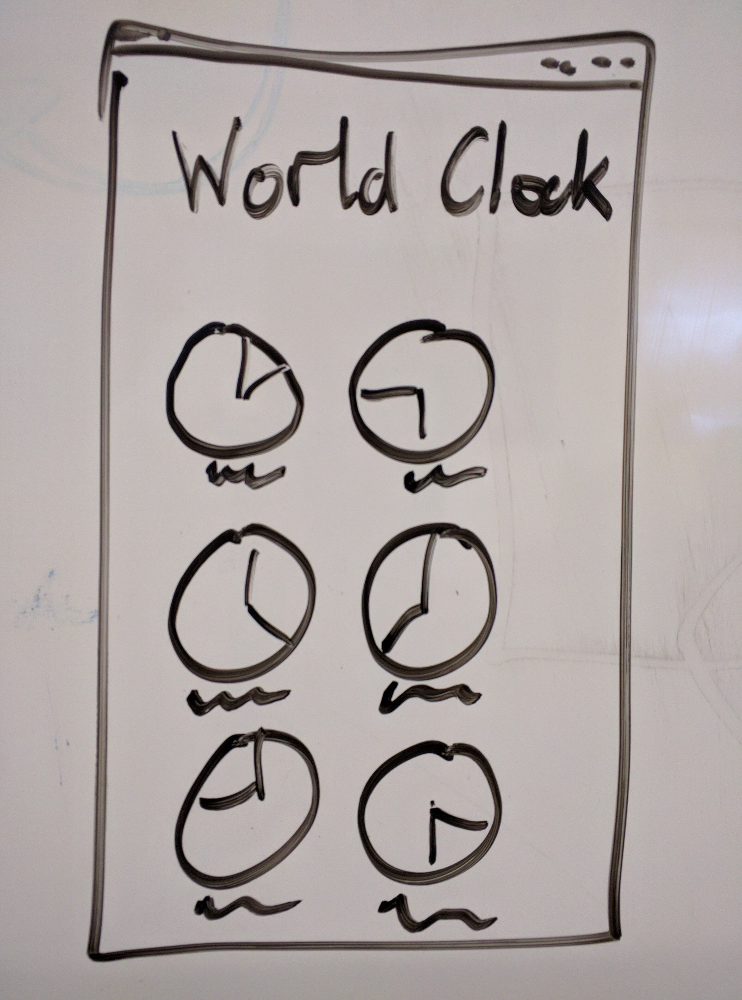

<!--
Copyright (c) 2016, the Flutter project authors.  Please see the AUTHORS file
for details. All rights reserved. Use of this source code is governed by a
BSD-style license that can be found in the LICENSE file.
-->

Flutter: A Walk Up A Mahogony Staircase
=======================================

Prologue
--------

This talk is intended to explain Flutter's design. As such, it starts
from first principles and slowly walks up to the full design. This
means that, especially early in the talk, the code presented will not
be very ergonomic. If you're looking for a tutorial on how to use
Flutter, this is not it. Nor is it a comprehensive API description.

   This is a tutorial: https://flutter.io/tutorial/

   These are our API docs: http://docs.flutter.io/

   This is our Web site with more information: https://flutter.io/


Chapter 1: Let's create an app!
-------------------------------



```
$ flutter create world_clock
```

